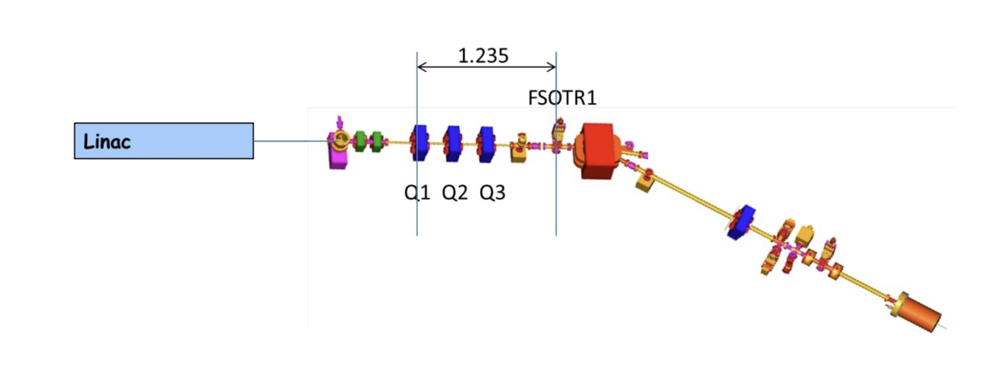
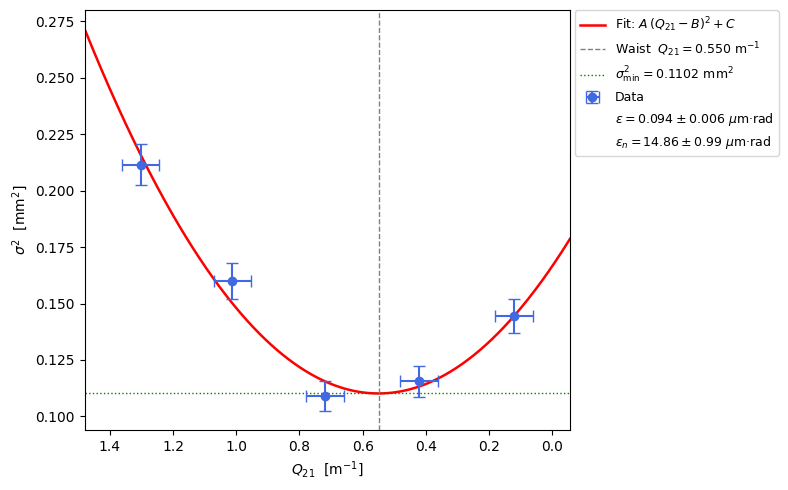
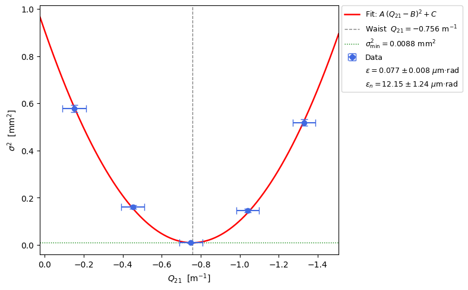
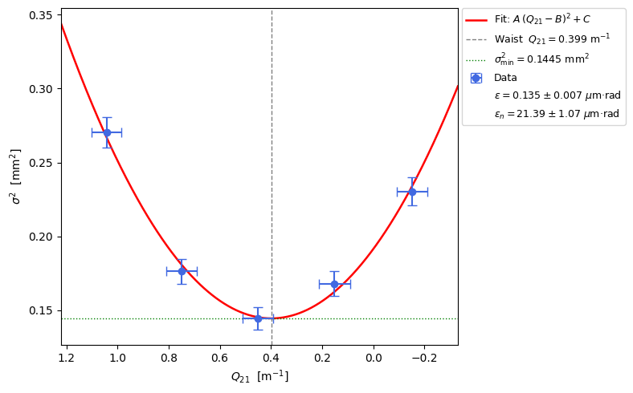
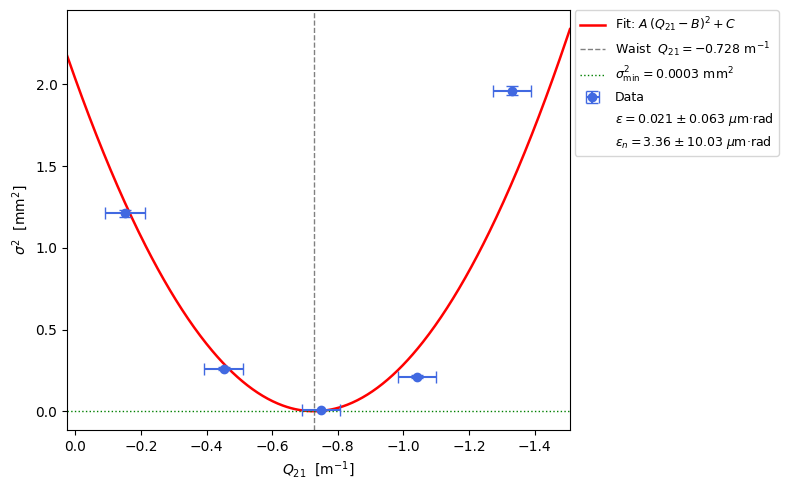

<h1 align="center">Emittance Measurements at the ALBA Linac</h1>

<p align="center">
Beam diagnostics and transverse emittance characterization of the ALBA Linac beam using the quadrupole scan method.
</p>

---

## Overview
The objective of the project is to characterize the transverse beam emittance of the ALBA Linac using the **quadrupole scan technique**, comparing the beam properties in:

- **Multi-bunch operation**
- **Single-bunch operation**

The analysis is based on beam-size measurements acquired at the FSOTR diagnostic screen while varying the strength of quadrupole **Q1** around the beam waist.

---

## Experimental Setup

The measurements were performed at the ALBA Linac transfer line. The beam is transported through a quadrupole section and observed on the FSOTR screen.

### Beamline Layout

<p align="center">
  
</p>

*Sketch of the ALBA Linac, transfer line, and diagnostics section used for the emittance measurements.*

---

## Analysis Workflow

The analysis follows these steps:

1. Measure beam size on the FSOTR screen.
2. Convert quadrupole current into focusing strength.
3. Compute transport parameters.
4. Perform a quadrupole scan around the beam waist.
5. Fit the measured beam size squared with a parabola.
6. Compare results with ALBA control-room diagnostics.
---

## Repository Structure

```text
.
├── Figures/
│   │
│   ├── sketch.png
│   │
│   ├── 10h37_BCM_(1).png
│   ├── 10h39_BeamCharge.png
│   ├── 10h48_Energy.png
│   ├── 11h08_emit_x.png
│   ├── 11h18_emit_y.png
│   ├── quad_scan_multibunchhorizontal.png
│   ├── quad_scan_multibunchvertical.png
│   │
│   │
│   ├── 11h42_emit_x_sb.png
│   ├── quad_scan_singlebunchhorizontal.png
│   └── quad_scan_singlebunchvertical.png
│
├── data-plots-tables.ipynb
├── report.tex
├── emittance_measurements_report.pdf
├── Guio_Practica_Emit_LT.pdf
├── 2026_Practicas_Emitt_LINCA_LT.pdf
└── README.md
```

---

## Results

### Multi-Bunch Mode

#### Beam Characteristics

| Quantity | Value |
|-----------|---------|
| Total Charge | 0.5 nC |
| Bunch Train Length | 78 ns |
| Number of Bunches | 39 |
| Beam Energy | 80.2 MeV |

#### Emittance Results

| Plane | Normalized Emittance |
|---------|--------------------|
| Horizontal | 14.9 ± 1.0 μm·rad |
| Vertical | 12.2 ± 1.2 μm·rad |

#### Horizontal Quad Scan

<p align="center">
  
</p>

#### Vertical Quad Scan

<p align="center">
  
</p>

---

### Single-Bunch Mode

#### Beam Characteristics

| Quantity | Value |
|-----------|---------|
| Total Charge | 0.04 nC |
| Bunch Train Length | 2 ns |
| Number of Bunches | 1 |
| Beam Energy | ~80 MeV |

#### Emittance Results

| Plane | Normalized Emittance |
|---------|--------------------|
| Horizontal | 21.4 ± 1.1 μm·rad |
| Vertical | 3.4 ± 10.0 μm·rad* |

\* Large uncertainty prevented a reliable determination of the vertical emittance.

#### Horizontal Quad Scan

<p align="center">
  
</p>

#### Vertical Quad Scan

<p align="center">
  
</p>

---

## Main Observations

- The thin-lens approximation remained valid throughout the scan range.
- Results agree with the ALBA control-room diagnostics.
- Multi-bunch operation produced normalized emittances of approximately 12–15 μm·rad.
- Single-bunch operation exhibited a larger horizontal emittance.
- The increase is consistent with stronger space-charge effects due to the higher charge density per bunch.
- Measured values are typical for a thermionic-gun linac operating around 80 MeV.

---

## Reproducing the Analysis

### Requirements

```bash
pip install numpy scipy pandas matplotlib jupyter
```

### Launch the Notebook

```bash
jupyter notebook data-plots-tables.ipynb
```

The notebook performs:

- Data loading
- Quadrupole calibration
- Beam transport calculations
- Parabolic fitting
- Emittance calculations
- Figure generation

---

## Conclusions

The transverse emittance of the ALBA Linac beam was successfully characterized using quadrupole scans in both multi-bunch and single-bunch operating modes.

The results demonstrate:

- Consistency with ALBA diagnostic tools.
- Validity of the thin-lens approximation for the explored focusing strengths.
- Increased horizontal emittance in single-bunch operation due to space-charge effects.
- Typical normalized emittances in the range of 10–20 μm·rad for an 80 MeV thermionic-gun linac.

---
